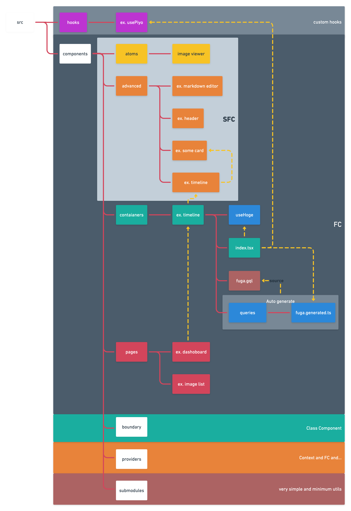
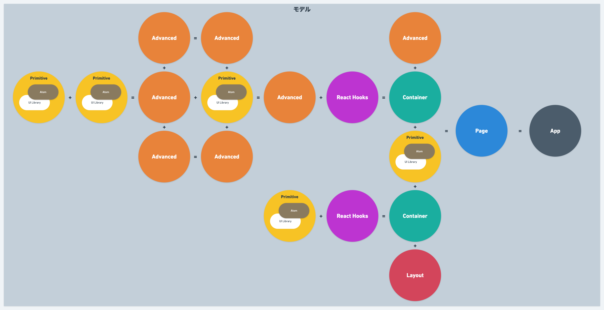
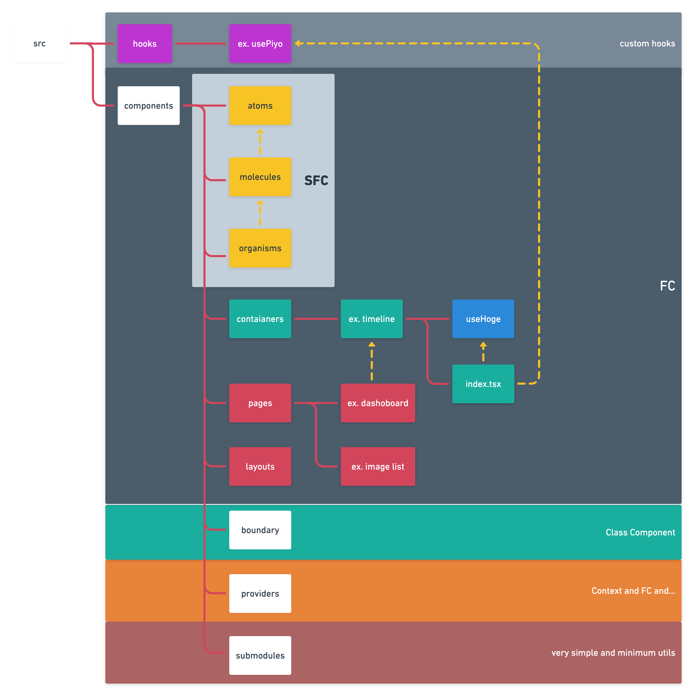
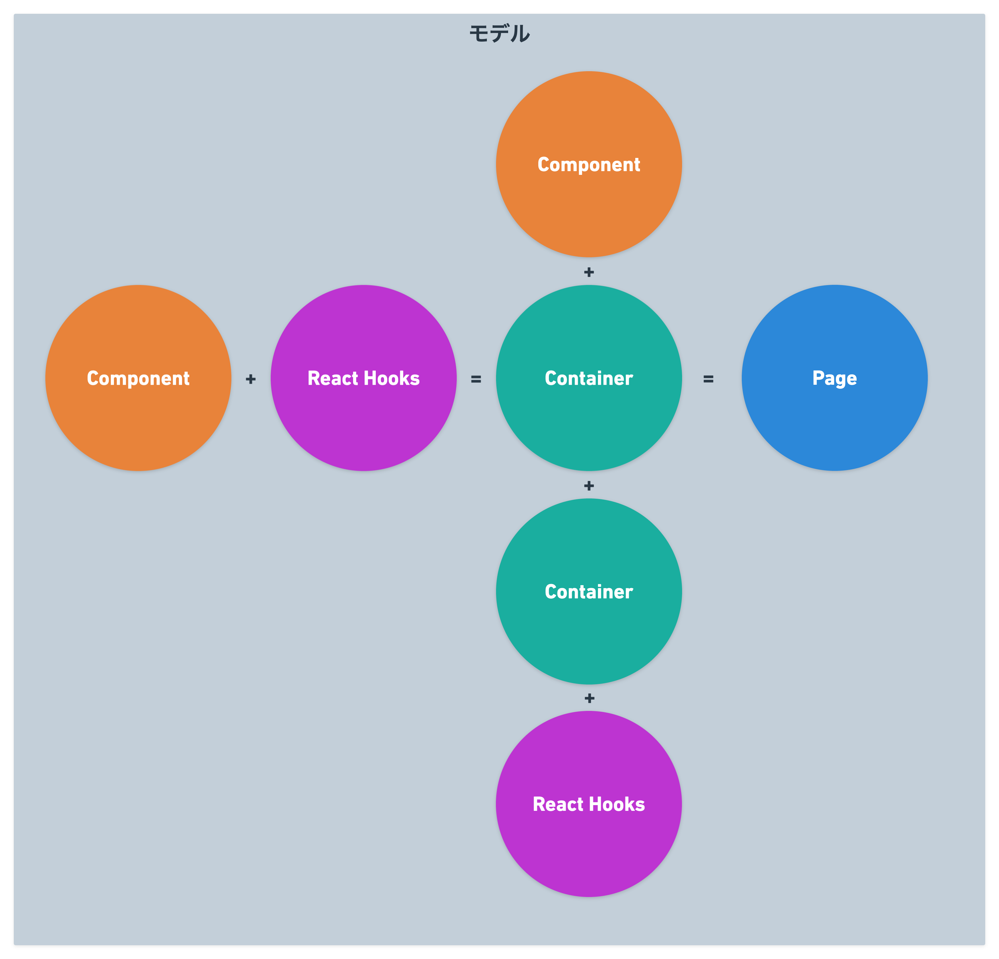

# nuxt-ssr-user

## Usage

```bash

# serve with hot reload at localhost:3000
$ cp .env.default .env
$ yarn run dev

# build for production and launch server
$ yarn build
$ yarn start

# generate static project
$ yarn generate
```

For detailed explanation on how things work, check out [Nuxt.js docs](https://nuxtjs.org).

## ディレクトリ構成

手軽にUIライブラリに乗ってやる場合はこの感じで手軽にやるのはありだなと思います.




しっかりとAtomic Design等を駆使して作っていく場合はこちらの構成が良いと思います.



この差の理由として、Atomic Designの場合は小さいコンポーネントも全て自前でしっかり作って行くことになると思いますが、殆どの場合でかなりコストがかかると思います.
どこかのUIライブラリに乗っかる場合は、Atomic DesignでいうところのAtom Molecules Organismsが8割以上既に構築されているような状況を期待します.
なので、適当にUIライブラリ + 作ったCustom Hooksを組み合わせてContainerを構築するだけで充分見通しよく作れます.

## おすすめ学習文献

* https://ja.reactjs.org
* https://ja.reactjs.org/docs/hooks-custom.html
* https://qiita.com/Takepepe/items/41e3e7a2f612d7eb094a
* https://qiita.com/Takepepe/items/eec6e1d2101570e7e241
* https://qiita.com/Takepepe/items/a6db0d68ff7a9a9a7863
* https://pomb.us/build-your-own-react
* https://qiita.com/takeyuichi/items/41776005061f1697d67d

## Setup
- Env
    - .env.defaultをPJに合わせて変更する。
- Auth Module
    - `nuxt.config.js`に、ログインのためのエンドポイントを指定する箇所があるので、プロジェクトに合わせて変更する
    - もしrefreshが必要な場合は、axiosのplugin側で以下のようなコードを追加する(必要箇所はよしなに変更してください)
        ```
        ...
        $axios.onResponseError((error) => {
          const code = parseInt(error.response && error.response.status)
          if (code === 401) {
            $axios
              .post('/api/v1/admin/refresh_tokens', {
                userName: localStorage.getItem('userName'),
                refreshToken: localStorage.getItem('refreshToken'),
              })
              .then((res) => {
                if (res.status === 200) {
                  console.log('success refresh')
                  store.$auth.setUserToken(res.data.accessToken)
                  localStorage.setItem('refreshToken', res.data.refreshToken)
                  const config = error.config
                  config.headers.Authorization = 'Bearer ' + res.data.accessToken
                  return $axios.request(error.config)
                } else {
                  console.log('failure refresh')
                  store.$auth.logout()
                  store.$router.push('login')
                }
              })
              .catch(() => {
                console.log('failure refresh')
                store.$auth.logout()
                store.$router.push('login')
              })
            return
          }
          ...
        })
        ```
- Vuex
    - Storeにサンプルのstateが入っているので、PJに合わせて変更する。
- Logo
    - `/static`に画像を入れて`/layout`から呼んでいるので、画像をここに入れる。
 
 
## Testing

### 起動方法/ファイルの置き場など
- プロジェクトルートにて以下コマンド実行で専用画面が立ち上がってテストを回せるようになる
  - `$ yarn run cypress open`

- ファイルの置き場はの以下のディレクトリ配下にテストコードを入れると勝手にロードしてくれて、テストできるようになる
  - `/cypress/integration`
  - (ディレクトリがない場合は初回`yarn run cypress open`実行時に生成してくれる)

- サポートツールのインストール
  - [Cypress Recorder - ChromeExtension](https://chrome.google.com/webstore/detail/cypress-recorder/glcapdcacdfkokcmicllhcjigeodacab)
  - Chrome拡張として、自分のブラウザでの行動をレコードしてくれるものがある。そのままテスト実行などは出来ないが、コードを記述する手間を大分削減でき、あとから痒いところは編集できるので使っていくのがよさそう

### テスト作成のルーティーン
- 3ステップでテストを生成していく
  - 1 該当要素にdata属性を付与する ex. `<input type="text" name="email" data-cy="login-email"`
  - 2 上述のChrome拡張で操作のレコード
  - 3 2.で生成したテストコードの微調整
※詳しくは[こちらのscrapboxを参照](https://scrapbox.io/ispec/2021%E5%B9%B4_%E3%83%95%E3%83%AD%E3%83%B3%E3%83%88%E3%82%A8%E3%83%B3%E3%83%89%E8%87%AA%E5%8B%95%E3%83%86%E3%82%B9%E3%83%88)


