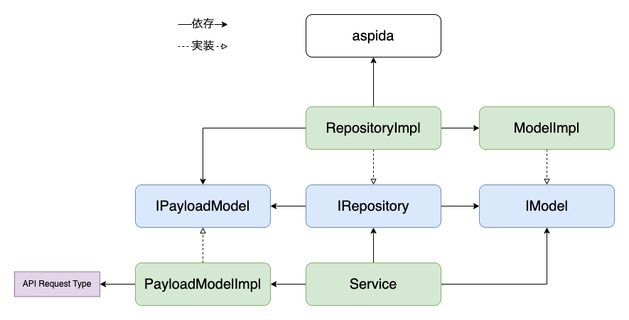

# Frontend Data Flow Architectue

## 背景
- APIとのデータのやり取りにおいて、「レスポンス内容の処理」「ステート管理」「JSONとフロントで扱うデータの相互変換」などの処理や責務の分担が煩雑にならないようにしたい

## 目的
- 主にフロントで扱いたいデータを処理する部分と、APIに依存する処理を実装する部分でレイヤーを分け、お互いのレイヤーで密結合にならないように実装することで、修正が必要な箇所が出た場合でもその影響が狭い範囲にしか及ばないようにする

## 設計の大まかな図

## 各レイヤーについて
- [Models](./layers/model/index.md)
  - [DomainModel](./layers/model/domain.md)
  - [PayloadModel](./layers/model/payload.md)
- [Gateways](./layers/gateway.md)
- [Services](./layers/service/index.md)
  - [Usecases](./layers/service/usecases.md)

## 実装手順について
- [こちら](./impl-procedure.md)
