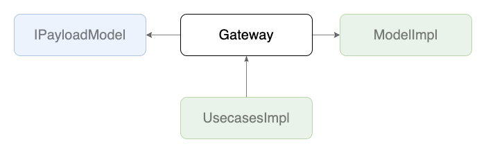

# Gateways

## 背景
- 各箇所で毎回API呼び出しコードを書いていると、同じエンドポイントを叩く場合に重複したコードができてしまう
- APIの呼び出し->レスポンスとして返ってきたデータの整形がセットになっている場合、さらに重複するコードが増える

## 目的
- APIの呼び出し、レスポンスデータの整形を1つの関数で行えるようにすることで、処理をまとめて再利用しやすい形にする。
- 似たパスのエンドポイントを呼び出す関数群をnamespace単位で束ねることで、管理を容易にする。

## 定義
- `~/core/gateways/**`で実装される

## 実装
- `XXXGateway`という形式で命名されたnamespace内で関数の形で実装される
- 関数は、プリミティブな値か[PayloadModel](./model/payload.md)を受け取り、voidか[Model(DomainModel)](./model/domain.md)のPromiseを返す
- レスポンスデータの[Model(DomainModel)](./model/domain.md)への変換処理のほとんどは[Model(DomainModel)](./model/domain.md)へ任せる
- API疎通時のエラーは必ずcatchし`Promise.reject`を返すようにする

## 実装例
- [SampleGateway](https://github.com/ispec-inc/monorepo/blob/update/frontend/data-flow/typescript/apps/admin/core/gateway/sample/index.ts)

## 関連

## バックリンク
- [Usecases](./service/usecases.md)
- [Frontend Data Flow Architectue](../index.md)
