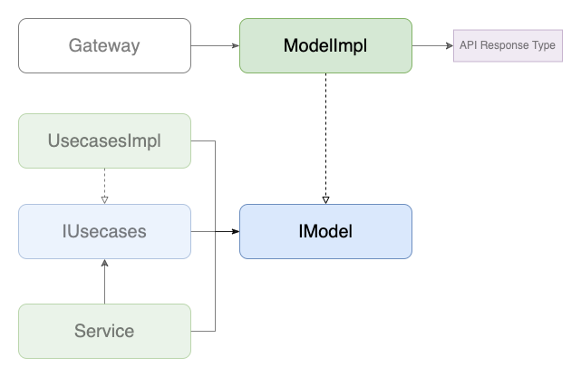

# Model (DomainModel)

## 背景
- [Models](./index.md)の「背景」の項参照

## 目的
- [Models](./index.md)の「目的」の項参照

## 定義
- フロントで扱うデータのうち、APIへ送信する値に関連するもの以外を扱うための[Models](./index.md)
- APIから受け取る値に紐づくものが殆どであるが、その他データ変換などの機能を吸収するためのモジュールとして実装することもできる
  - そのデータ変換機能のうち、先述した「APIへ送信する値に関連するもの」は[PayloadModel](./payload.md)として実装する
- `~/core/models/domain/**`で実装される

## 実装
- `$ yarn hygen model new`でファイルを生成
- 生成されたファイルでinterfaceを定義し、同ファイルで実装を書く
- コンストラクタでは原則APIの実装に合わせて定義した型は扱わず、プリミティブな値を受け取る形が望ましい(汎用性を高めるため)
  - 引数が多くなりそうな場合は、タプル型を用いるか、同ファイルで引数用の型を定義してそれを使用することができる
- APIからのレスポンス型に紐づく`Model`である場合は、そのレスポンス型で値を引数に取り自身のインスタンスを返すstatic関数を`fromApiResponse`という名前で実装することができる

## 実装例
- [SamplePostModelImpl](https://github.com/ispec-inc/monorepo/blob/update/frontend/data-flow/typescript/apps/admin/core/models/domain/sample/index.ts)
- [SamplePostCommentModelImpl](https://github.com/ispec-inc/monorepo/blob/update/frontend/data-flow/typescript/apps/admin/core/models/domain/sample/comment/index.ts)

## 関連

## バックリンク
- [Models](./index.md)
- [Gateways](../gateway.md)
- [Services](../service/index.md)
- [Usecases](../service/usecases.md)
- [Frontend Data Flow Architectue](../../index.md)
- [実装手順](../../impl-procedure.md)
