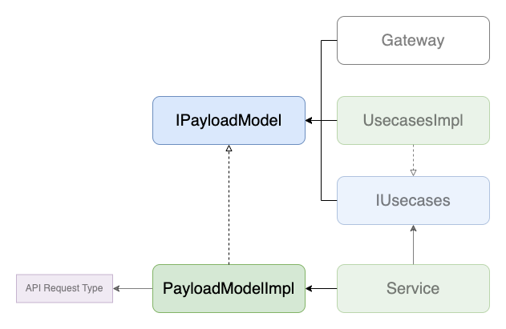

# PayloadModel

## 背景
- [Models](./index.md)の「背景」の項参照

## 目的
- [Models](./index.md)の「目的」の項参照

## 定義
- フロントで扱うデータのうち、APIへ送信する値に関連するものを扱うための[Models](./index.md)
- 必ず`toObject()`というAPIへ送信するデータの型定義に則った値を返す関数を持っている
- `~/core/models/payload/**`で実装される

## 実装
- `$ yarn hygen model new`でファイルを生成
- 生成されたファイルに記述されているinterfaceの定義文のうち、`/* Replace with the corresponding api request type */`となっている部分を対応する型に置き換える
- コンストラクタでは原則APIの実装に合わせて定義した型は扱わず、プリミティブな値を受け取る形が望ましい(汎用性を高めるため)
  - 引数が多くなりそうな場合は、タプル型を用いるか、同ファイルで引数用の型を定義してそれを使用することができる

## 実装例
- [SampleCreatePayloadModelImpl](https://github.com/ispec-inc/monorepo/blob/update/frontend/data-flow/typescript/apps/admin/core/model/payload/sample/create/index.ts)

## 関連

## バックリンク
- [Models](./index.md)
- [Gateways](../gateway.md)
- [Services](../service/index.md)
- [Frontend Data Flow Architectue](../../index.md)
