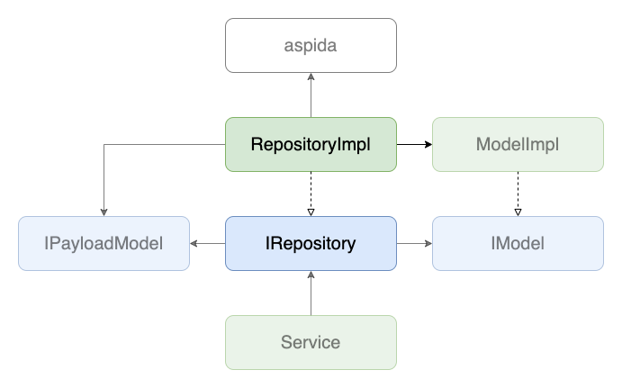

# Repositories

## 背景
- 複数のエンドポイントを叩く必要のあるページだと、管理すべき値(ステート)や、APIからのレスポンス待ち状態を表す変数が増えてしまい、これを一箇所で全て扱うとコード量が偏ってしまう。

## 目的
- aspida経由でのAPIへのアクセス、APIから返却された値の保持、APIからのレスポンス待ち状態を表す変数の管理を引き受けることで、[Service](./index.md)にはビジネスロジックを組み立てることに専念させる

## 定義
- `~/core/repositories/**`で実装される
- 基本的に各エンドポイントに対して1:1で対応する
- 生成されたファイルでinterfaceを定義し、同ファイルで実装を書く

## 実装
- `$ yarn hygen repository new`でファイルを生成
- APIはaspida経由で呼び出し、基本的にAsyncProcessHelperを用いることで、APIのレスポンス待ち状態を表せるように実装する
- APIから返却されたJSONを[DomainModel](./layers/model/domain.md)へ変換、インスタンス内に保存する
- 定義されるプロパティはすべてreadonlyにする

## 実装例
- [SamplePostFindAllRepositoryImpl](https://github.com/ispec-inc/monorepo/blob/update/frontend/data-flow/typescript/apps/admin/core/repositories/sample/post/find-all/index.ts)
- [SamplePostUpdateRepositoryImpl](https://github.com/ispec-inc/monorepo/blob/update/frontend/data-flow/typescript/apps/admin/core/repositories/sample/post/update/index.ts)

## 関連

## バックリンク
- [Services](./index.md)
- [Frontend Data Flow Architectue](../../index.md)
- [実装手順](../../impl-procedure.md)
