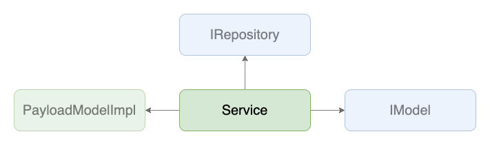

# Services

## 背景
- APIから受け取った値の保持や整形、APIの呼び出し処理、APIのレスポンスを待っている間の状態を表す変数などの管理をvueコンポーネントの実装で行うと、フォームにバインドする値などの定義も混ざってView側のコードが肥大してしまう

## 目的
- 各画面で必要になるビジネスロジックを吸収し、Viewには画面の表示周りに専念させる

## 定義
- `~/core/services/**`で実装される
- ServiceとViewは1:1で対応する
- エラーハンドリングはここでは基本行わず、Viewに行わせる

## 実装
- `$ yarn hygen service new`でファイルを生成
- 利用するエンドポイントの分だけ[Repositories](../repositories/index.md)を持つことができる
  - この層で持つ[Repositories](../repositories/index.md)は、同ファイルの`Repositories`という名前のinterfaceで定義する
- APIを呼び出す際は、基本[Repositories](../repositories/index.md)を介して呼び出す
- この層でステート管理はできる限り行わないようにし、APIに関係するステート管理は全て[Repositories](../repositories/index.md)へ移譲する
- APIへなんらかの値を送信する際は、このレイヤーでその値を利用して[PayloadModel](../model/payload.md)をインスタンス化する
- [Repositories](../repositories/index.md)、[Model(DomainModel)](../model/domain.md)を扱う際は抽象(interface)に対して依存させる
- 「目的」の項にもあるが、Viewから切り離せそうなロジックはできるだけこのレイヤーへ寄せ、Viewには画面の表示関係に専念させる

## 実装例
- [SampleListPageService](https://github.com/ispec-inc/monorepo/blob/update/frontend/data-flow/typescript/apps/admin/core/services/sample/list/index.ts)
- [SampleUpdatePageService](https://github.com/ispec-inc/monorepo/blob/update/frontend/data-flow/typescript/apps/admin/core/services/sample/update/index.ts)

## 関連

## バックリンク
- [Repositories](../repositories/index.md)
- [Frontend Data Flow Architectue](../../index.md)
- [実装手順](../../impl-procedure.md)
