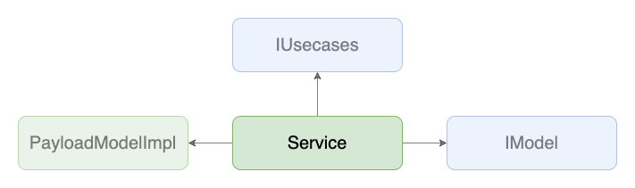

# Services

## 背景
- APIから受け取った値の保持や整形、APIの呼び出し処理、APIのレスポンスを待っている間の状態を表す変数などの管理をvueコンポーネントの実装で行うと、フォームにバインドする値などの定義も混ざってView側のコードが肥大してしまう

## 目的
- ViewとAPIを繋ぐためのモジュールとして、APIから得られたデータの管理や、Viewへ公開するデータの細かい整形などを行う
- 各画面で必要になるビジネスロジックを吸収し、Viewには画面の表示周りに専念させる
- 具体的なエラーハンドリングを行い、必要があればViewへエラー内容を通知する

## 定義
- `~/core/services/**`で実装される
- ServiceとViewと[Usecases](./usecases.md)は1:1:1で対応し、うち[Usecases](./usecases.md)のインスタンスをメンバ変数として持つ

## 実装
- `$ yarn hygen service new`でファイルを生成
- APIを呼び出す際は、必ず[Usecases](./usecases.md)を介して呼び出す
- APIへなんらかの値を送信する際は、このレイヤーでその値を利用して[PayloadModel](../model/payload.md)をインスタンス化する
- [Usecases](./usecases.md)、[Model(DomainModel)](../model/domain.md)を扱う際は抽象(interface)に対して依存させる
- 具体的なエラーハンドリング、`ErrorModel`のインスタンス化はこのレイヤーか、必要に応じてViewで行う
- 基本的にAPI呼び出し時は`AsyncProcessHelper`を利用し、エラーハンドリングやAPI待ちかどうかのステータスの管理を行う(実装例参照)
  - 実際に表示するエラーメッセージは`AsyncProcessHelper`の`errorMessage`か`errorMessageStream`をgettterで公開することでViewへ伝える
- 「目的」の項にもあるが、Viewから切り離せそうなロジックはできるだけこのレイヤーへ寄せ、Viewには画面の表示関係に専念させる

## 実装例
- [SampleListPageService](https://github.com/ispec-inc/monorepo/blob/update/frontend/data-flow/typescript/apps/admin/core/service/sample/list/index.ts)
- [SampleUpdatePageService](https://github.com/ispec-inc/monorepo/blob/update/frontend/data-flow/typescript/apps/admin/core/service/sample/update/index.ts)

## 関連

## バックリンク
- [Usecases](./usecases.md)
- [Frontend Data Flow Architectue](../../index.md)
- [実装手順](../../impl-procedure.md)
