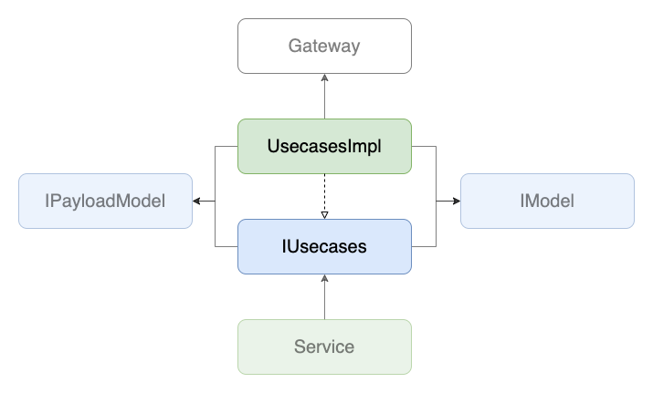

# Usecases

## 背景
- 一度の処理で複数のエンドポイントを順番に呼び出さなくてはいけない場合などに、その複雑な処理を[Services](./index.md)に書いてしまうと、1つの関数が肥大化してしまいコードが読みづらくなってしまう

## 目的
- [Services](./index.md)がもつロジックのうち[Gateways](../gateway.md)へのアクセスに関するものを引き受け、[Services](./index.md)のコードを読みやすくする
  - 複雑な手順で複数のエンドポイントにアクセスする場合はその具体的な手順を[Services](./index.md)から隠蔽する
- [Services](./index.md)から[Gateways](../gateway.md)への直接の依存を切る
  - これによりマークアップ実装の際に[Gateways](../gateway.md)の実装を遅らせることができるので、このレイヤーを境として実装範囲を決めることができる(このレイヤーでダミーデータを返すようにする)
  - (上記の利点が自分の中では弱いので、現状目的というより副次的なものに近いです)

## 定義
- `~/core/services/**/usecases.ts`で実装される
- [Service](./index.md)とViewとUsecasesは1:1:1で対応する
- 生成されたファイルでinterfaceを定義し、同ファイルで実装を書く

## 実装
- (`$ yarn hygen service new`でServiceと一緒にファイルが生成される)
- 関数は、プリミティブな値か[PayloadModel](../model/payload.md)を受け取り、voidか[Model(DomainModel)](../model/domain.md)のPromiseを返す

## 実装例
- [SampleUpdatePageUsecasesImpl](https://github.com/ispec-inc/monorepo/blob/update/frontend/data-flow/typescript/apps/admin/core/service/sample/update/usecases.ts)

## 関連

## バックリンク
- [Services](./index.md)
- [Frontend Data Flow Architectue](../../index.md)
